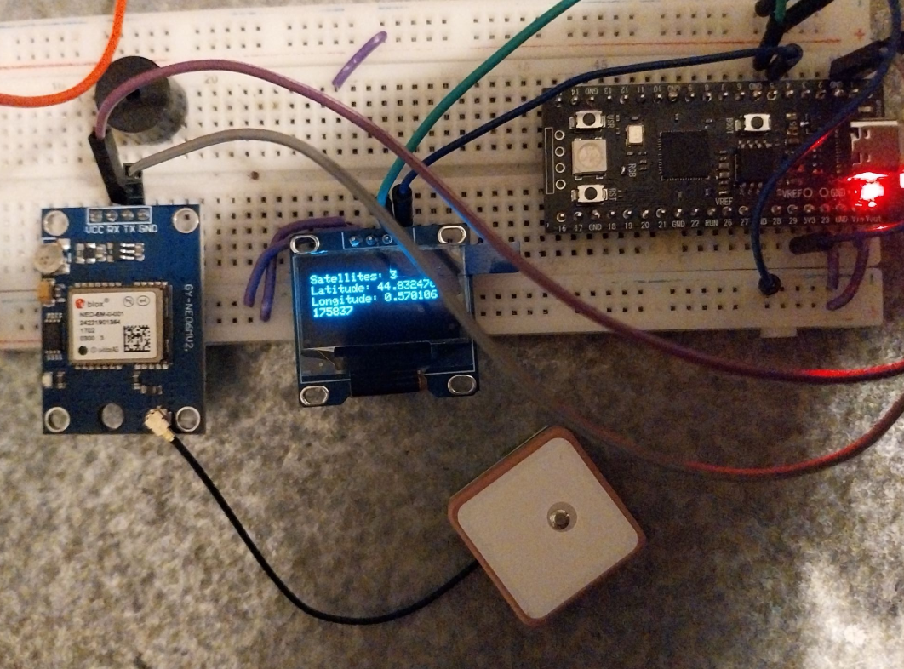

🚀 Pico GPS Tracker & Map Plotter
Turned a Raspberry Pi Pico clone into a "precise" GPS logger and visualize your adventures! This project captures live GPS data, saves it, and then plots your journey  using Python. Initally a GPS test turned into a University grade !

✨ **Features**
- Real-time GPS Data: Grabs latitude, longitude, altitude, and time from a cheap AliExpress GPS module via serial.

- Data Logging: Automatically saves all your route data to a file on your PC (via Python script) for easy analysis.

- MQTT integration : Publish you position to a MQTT broker ! 

- Map Visualization: A Python script transforms your logged data into a stunning route graph using matplotlib.

- Cost-Effective: Built with readily available, inexpensive hardware.

- Data post-treatement: The GPS module was so bad that i had to heavily smooth out the data to make usable
- 

⚙️ **How It Works (Quick Glance)**
- Pico + GPS (C++): The C++ code on your Pico constantly reads NMEA sentences from the GPS module, parses the essential location data, and sends it over the Pico's USB serial port in a CSV-compatible format.

- PC (Python): A separate Python script on your computer connects to the Pico's serial port, reads the incoming GPS data, logs it to a local file.

- PC plotting : You can take all the collected data and generates a matplotlib plot of your route, saving it as an image file.

🛠️ **The Prototype :**

🤝 Contributing
Got ideas? Found a bug? Pull requests are welcome!

📄 License
This project is open source under the MIT License.